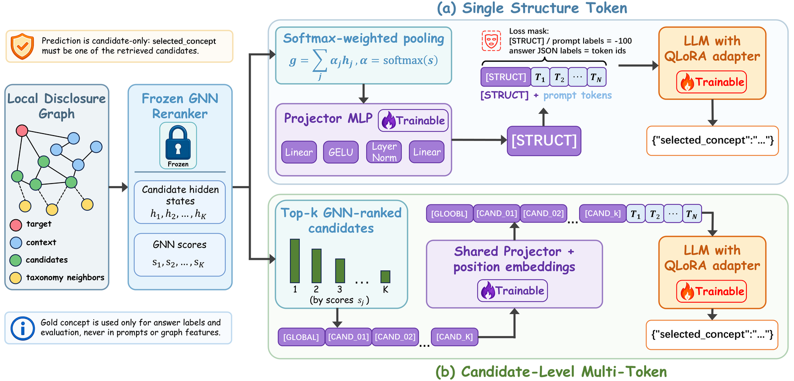
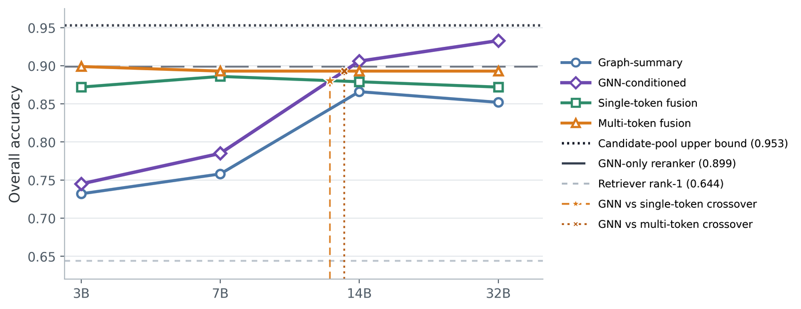
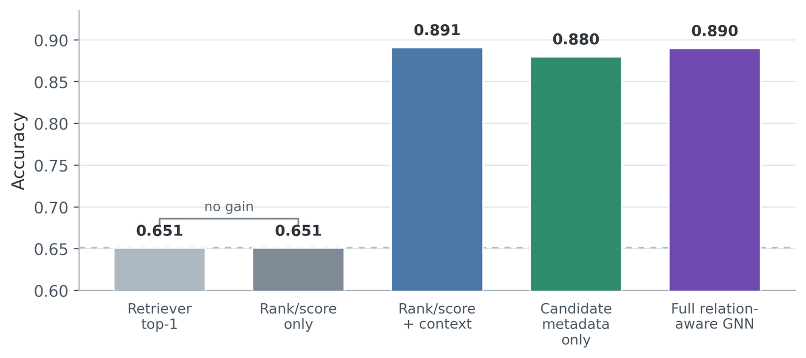

# FinGSI

FinGSI (Financial Graph-Structure Interfaces) is a research prototype for
fact-level XBRL concept linking. Given a financial line item, its table context,
and a fixed pool of candidate US-GAAP concepts, the task is to select the best
concept inside that candidate boundary. To our knowledge, FinGSI is the first
framework to bring graph-structure (GNN) signals into LLM-based selection for
this task; it then studies *how* that structure should be exposed to an LLM as
model scale grows.

This `submission/` folder is a compact public-facing package for paper review. It
shows the framework idea without exposing internal experiment engineering. It
does not include training pipelines, model checkpoints, private run logs, raw
evaluation outputs, local environment notes, or internal handoff documents.

## Contents

```text
submission/
  README.md                         # this public overview
  demo/
    run_demo.py                     # command-line entry point
    samples.json                    # small illustrative examples
    fingsi_demo/                    # dependency-free framework package
      schema.py                     # shared score/data helpers
      retriever.py                  # candidate-pool stage
      graph.py                      # local disclosure graph skeleton
      reranker.py                   # GNN-style structure reranker
      selectors.py                  # prompt and structure-fusion selectors
      verifier.py                   # conservative audit layer
      pipeline.py                   # end-to-end orchestration
  figures/
    pipeline.png                        # full FinGSI pipeline figure
    fusion_architecture.png             # learned structure-token fusion figure
    combined_accuracy_crossover.png     # accuracy + scale-dependent crossover (all selectors)
    signal_attribution_ablation.png     # GNN signal-attribution ablation
```

## What The Demo Shows

The demo is not just a single heuristic scorer. It mirrors the full paper
framework with lightweight, inspectable components:

```text
CandidateRetriever
-> LocalDisclosureGraphBuilder
-> GNN-style structure reranker
-> graph-summary prompt selector
-> GNN-conditioned prompt selector
-> single-token structure-fusion selector
-> multi-token structure-fusion selector
-> conservative verifier
```

The real paper uses SEC-derived samples, US-GAAP taxonomy relations, a trained
relation-aware GNN, frozen and QLoRA-adapted Qwen2.5 models, and paired
statistical evaluation. The public demo uses a few small JSON examples and
transparent standard-library scoring so that readers can inspect the data flow
without downloading models or reproducing the full experiments.

## Run The Demo

From the repository root:

```bash
python submission/demo/run_demo.py submission/demo/samples.json
```

From inside `submission/`:

```bash
python demo/run_demo.py demo/samples.json
```

By default, the demo runs every public selector and prints JSON output:

```bash
python submission/demo/run_demo.py submission/demo/samples.json --selector all
```

Run one selector at a time:

```bash
python submission/demo/run_demo.py submission/demo/samples.json --selector graph_summary_prompt
python submission/demo/run_demo.py submission/demo/samples.json --selector gnn_conditioned_prompt
python submission/demo/run_demo.py submission/demo/samples.json --selector single_token_fusion
python submission/demo/run_demo.py submission/demo/samples.json --selector multi_token_fusion
```

Use a smaller candidate pool in the toy example:

```bash
python submission/demo/run_demo.py submission/demo/samples.json --k 2
```

The output for each sample includes:

- the candidate pool;
- a local graph summary with node and edge types;
- the GNN-style reranker top candidates;
- each selector's selected concept and signals;
- a conservative verifier result.

## Paper Task

FinGSI studies candidate-constrained concept selection:

```text
financial line item + table context + candidate XBRL concepts
-> selected XBRL concept
```

A single shared retriever first returns a top-50 candidate pool, and every
graph, GNN, prompt, or learned-fusion selector must choose one concept from that
pool. The methods differ only in *how* they use the pool, not in what is
retrieved. If the gold concept is not in the candidate pool, no downstream
candidate-only selector can recover it, which keeps retrieval errors and selector
errors clearly separated.

## Method Summary

The paper compares four concept selectors spanning a readable-to-learned
spectrum:

1. GNN-only reranker over leakage-safe local disclosure graphs.
2. Graph-summary prompting, where local graph evidence is verbalized for an LLM.
3. GNN-conditioned prompting, where candidate ids, ranks, retriever scores, and
   GNN scores are exposed as readable prompt evidence.
4. Learned structure-token fusion, where frozen GNN hidden states are projected
   into the LLM embedding space and trained with QLoRA adapters.

The learned-fusion line has two variants:

- Single-token fusion: one pooled structure token.
- Multi-token fusion: one global token plus candidate-level structure tokens.

For the statistical interface claim, the single-token variant is the primary
comparison; the multi-token variant is reported as a stronger auxiliary variant.

Two non-structural references frame the structure interfaces: a candidate-only
LLM anchor (same candidate pool, no graph signal) and a naive BM25 text-RAG
baseline (its own, weaker retriever, not the shared pool). Both are reported only
under the separate full-file protocol.

## Evaluation Protocols

Two protocols are reported and should not be mixed:

| Protocol | Purpose | Samples | Notes |
| --- | --- | ---: | --- |
| Frozen test split | Graph, GNN, prompt, and structure-fusion comparisons | 149 | Shared CandidateRetriever top-50 pool; pool upper bound 142/149 = 0.953 |
| Full-file protocol | Non-structural LLM-only and BM25 text-RAG model-size references | 1000 | Separate protocol; not directly comparable to split-aligned structure results |

The headline metric is overall accuracy:

```text
overall accuracy = correct / all samples
```

## Split-Aligned Results

All rows below use the frozen 149-sample test split and the same top-50 candidate
boundary.

| Method | 3B | 7B | 14B | 32B |
| --- | ---: | ---: | ---: | ---: |
| Retriever top-1 | 0.644 | 0.644 | 0.644 | 0.644 |
| GNN-only reranker | 0.899 | 0.899 | 0.899 | 0.899 |
| Graph-summary prompting | 0.732 | 0.758 | 0.866 | 0.852 |
| GNN-conditioned prompting | 0.745 | 0.785 | 0.906 | 0.933 |
| Single-token projector + QLoRA | 0.872 | 0.886 | 0.879 | 0.872 |
| Multi-token projector + QLoRA | 0.899 | 0.893 | 0.893 | 0.893 |

The strongest split-aligned result is 32B GNN-conditioned prompting:

```text
139 / 149 = 0.933
```

This approaches the candidate-pool upper bound:

```text
142 / 149 = 0.953
```

## Paired Significance

Single-token learned fusion is the primary statistical comparison against
GNN-conditioned prompting.

| Pair | Gap | McNemar p | Interpretation |
| --- | ---: | ---: | --- |
| 3B single-token QLoRA vs 3B GNN prompt | +0.128 | 0.00256 | learned fusion significantly better |
| 7B single-token QLoRA vs 7B GNN prompt | +0.101 | 0.0107 | learned fusion significantly better |
| 14B GNN prompt vs 14B single-token QLoRA | +0.027 | 0.388 | prompt raw score higher, not significant |
| 32B GNN prompt vs 32B single-token QLoRA | +0.060 | 0.0352 | prompt significantly better |

The multi-token variant strengthens the small-model gains but reduces the
large-model prompt-side gap to non-significance:

| Pair | Gap | McNemar p | Interpretation |
| --- | ---: | ---: | --- |
| 3B multi-token QLoRA vs 3B GNN prompt | +0.154 | 0.000294 | learned fusion significantly better |
| 7B multi-token QLoRA vs 7B GNN prompt | +0.107 | 0.00249 | learned fusion significantly better |
| 14B GNN prompt vs 14B multi-token QLoRA | +0.013 | 0.774 | prompt raw score higher, not significant |
| 32B GNN prompt vs 32B multi-token QLoRA | +0.040 | 0.109 | prompt raw score higher, not significant |

So the large-scale *direction* is the same for both variants (readable prompting
is numerically ahead at 14B/32B); only the statistical *evidence* is
variant-dependent. We therefore report a scale-dependent crossover rather than a
categorical reversal.

## Non-Structural Full-File References

These rows use the separate 1000-sample full-file protocol and are included as
model-size references, not as direct competitors to the split-aligned structure
results. Text-RAG uses an independent BM25 retriever (top-1 0.315) rather than
the shared candidate pool (top-1 0.644).

| Method | 3B | 7B | 14B | 32B |
| --- | ---: | ---: | ---: | ---: |
| LLM-only + candidates | 0.675 | 0.708 | 0.788 | 0.800 |
| Text-RAG (BM25 + LLM) | 0.647 | 0.605 | 0.772 | 0.756 |

Within this same protocol, candidate-constrained LLM selection already
outperforms the naive BM25 text-RAG baseline at every model size (e.g. 0.800 vs.
0.756 at 32B), indicating that a strong candidate pool, not generic text
retrieval, is the right substrate for selection.

## Signal Attribution

To diagnose *why* GNN reranking helps, we run a controlled ablation under a
5-fold out-of-fold protocol over 1000 samples. This is a separate diagnostic from
the frozen test-set benchmark, so its absolute numbers are not directly
comparable to the split-aligned results above; we read it only for relative
attribution.

| Variant | Accuracy | Note |
| --- | ---: | --- |
| Retriever rank-1 | 0.651 | retrieval baseline |
| Rank/score-only MLP | 0.651 | rank/score features only, no graph |
| Candidate metadata, no edges | 0.880 | node features, message passing disabled |
| Full relation-aware GNN | 0.890 | nodes + relation edges |
| Rank/score + graph context | 0.891 | rank/score plus graph |

A rank/score-only MLP exactly reproduces the retriever baseline (0.651 vs.
0.651), so rank/score calibration alone adds nothing. The gain comes from the
disclosure graph: candidate metadata without edges already reaches 0.880, the
full relation-aware GNN reaches 0.890, and rank/score plus graph context reaches
0.891. These graph variants cluster within about one point, so no single
configuration is decisively best; relation edges add only a modest improvement
over the no-edge variant, while the bulk of the gain comes from graph-structured
candidate evidence rather than rank/score features. This supports treating the
GNN as a genuinely graph-augmented reranker. Finer per-edge-type ablations
(presentation vs. calculation vs. definition) are left to future work.

## Figures

### FinGSI Pipeline


### Learned Structure-Token Fusion



### Accuracy and Scale-Dependent Interface Crossover



All four candidate-constrained selectors are plotted across model sizes against
three fixed reference lines (retriever rank-1 0.644, GNN-only reranker 0.899, and
the candidate-pool upper bound 0.953), with both the single-token and multi-token
crossovers shown.

### Signal Attribution (GNN reranking)



## Main Conclusions

- Local graph structure is useful for candidate-constrained XBRL concept linking.
  GNN reranking raises retriever top-1 from 0.644 to 0.899 on the frozen split.
- A signal-attribution ablation traces this reranking gain to graph structure
  rather than rank/score calibration: a rank/score-only model stays at the
  retriever baseline (0.651), while graph-based variants reach about 0.88-0.89.
- The best structure interface is scale-dependent. Learned single-token fusion
  significantly improves small local LLMs at 3B and 7B, while readable
  GNN-conditioned prompting is significantly stronger at 32B and reaches 0.933,
  near the 0.953 candidate-pool ceiling.
- Multi-token learned fusion is a stronger auxiliary variant at small model
  sizes, but the large-model prompt-side statistical evidence is weaker for that
  variant, so we describe the trend as a crossover, not a categorical reversal.
- Conservative verification is an audit layer designed to avoid regressions, not
  an accuracy-repair shortcut at this operating point.

## Limitations

- The public demo is illustrative and does not reproduce trained GNN or QLoRA
  experiments.
- The split-aligned structure comparison uses a modest held-out test split
  (`N=149`).
- Results are based on SEC-derived samples and US-GAAP concepts.
- Gold labels are filer-assigned and may contain filer-side tagging
  inconsistencies.
